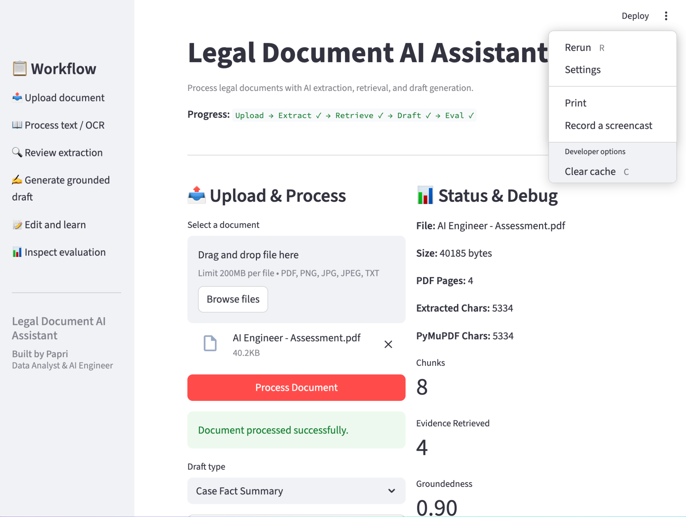
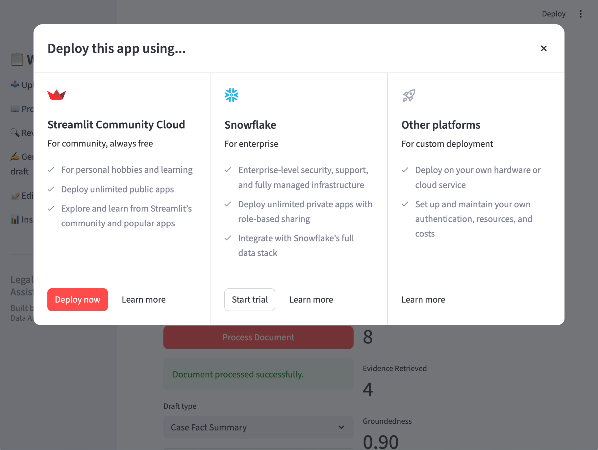
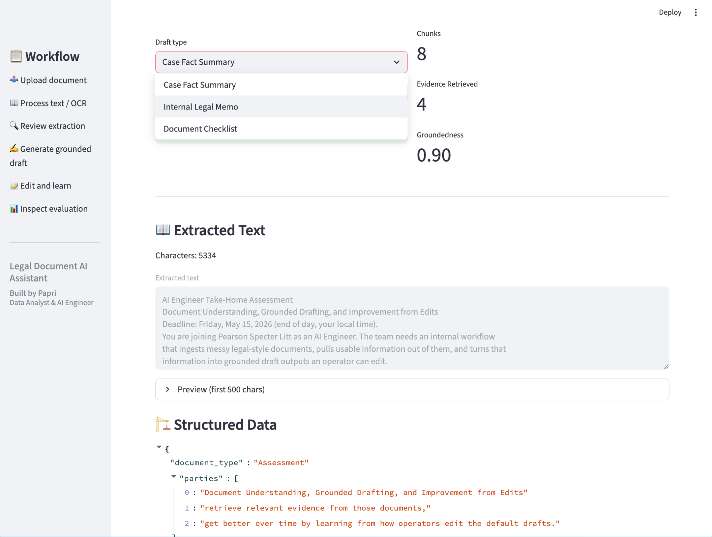
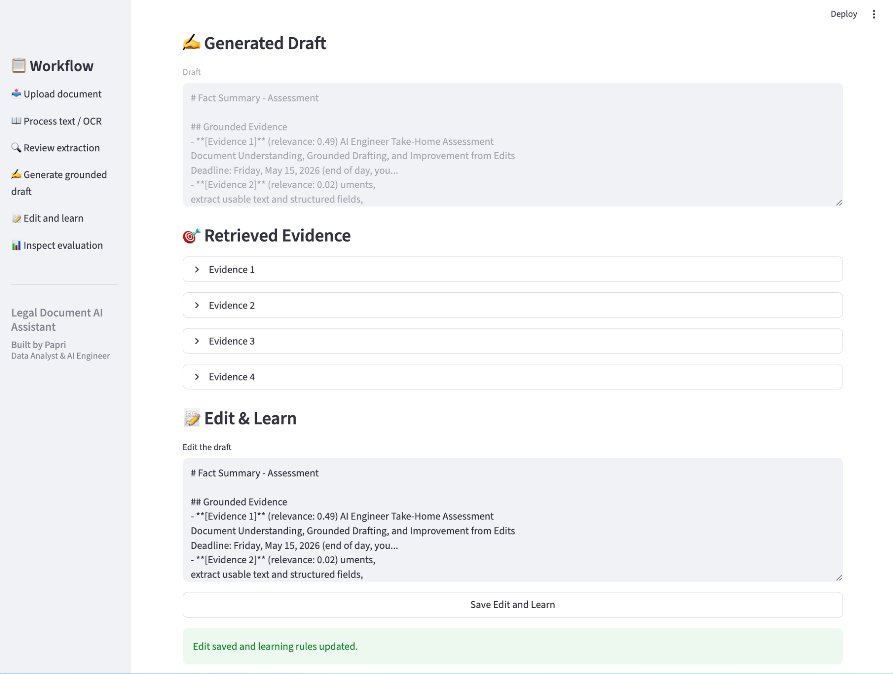
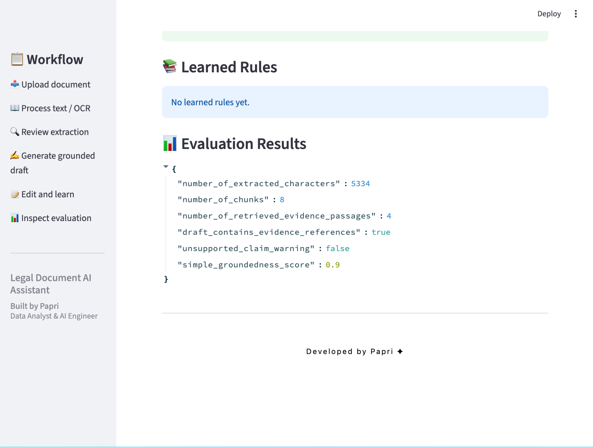

# ⚖️ Legal Document AI Assistant

AI-powered legal document processing system with OCR extraction, grounded draft generation, retrieval-based evidence, and evaluation workflow.

---

## 🚀 Features

- 📤 Upload PDF, PNG, JPG, JPEG, TXT documents
- 📖 OCR & text extraction
- 🏗️ Structured legal data generation
- 🎯 Evidence retrieval
- ✍️ Grounded draft generation
- 📝 Edit & learning workflow
- 📊 Evaluation & debugging system
- ☁️ Streamlit deployment ready

---

## 🖥️ Application Preview

### 1️⃣ Main Dashboard


---

### 2️⃣ Deployment Interface


---

### 3️⃣ Document Extraction & Structured Data


---

### 4️⃣ Generated Draft & Evidence Retrieval


---

### 5️⃣ Evaluation Results


---

## 🔄 Workflow

```text
Upload → Extract → Retrieve → Draft → Edit & Learn → Evaluate
```

---

## 🏗️ Architecture Overview

The app is organized into modular components for maintainability and testing.

- `app.py` → Streamlit UI & workflow coordination
- `document_processor.py` → OCR & extraction pipeline
- `structured_extractor.py` → Structured legal field extraction
- `retriever.py` → ChromaDB retrieval system
- `draft_generator.py` → Grounded draft generation
- `edit_learner.py` → Learning from operator edits
- `evaluator.py` → Groundedness & evaluation metrics

---

## 📂 Folder Structure

```text
legal-document-ai-assistant/
├── app.py
├── requirements.txt
├── README.md
├── .env.example
├── assets/
│   └── screenshots/
│       ├── dashboard.png
│       ├── deploy.png
│       ├── extraction.png
│       ├── draft.png
│       └── evaluation.png
├── data/
├── src/
└── samples/
```

---

## 🛠️ Tech Stack

- Python
- Streamlit
- PyMuPDF
- pytesseract
- Pillow
- ChromaDB
- OpenAI API
- python-dotenv

---

## ⚙️ Setup Instructions

### 1️⃣ Create Virtual Environment

```bash
python -m venv venv
```

### 2️⃣ Activate Environment

Windows:

```bash
venv\Scripts\activate
```

Mac/Linux:

```bash
source venv/bin/activate
```

### 3️⃣ Install Dependencies

```bash
pip install -r requirements.txt
```

### 4️⃣ Add OpenAI API Key

Create `.env` file:

```env
OPENAI_API_KEY=your_api_key_here
```

### 5️⃣ Run the Application

```bash
streamlit run app.py
```

---

## 📊 Evaluation Metrics

The system evaluates:

- Extracted character count
- Chunk count
- Retrieved evidence passages
- Citation coverage
- Unsupported claims
- Groundedness score

---

## 📌 Use Cases

- Legal notice analysis
- Contract review assistance
- Evidence-grounded drafting
- Internal legal memo preparation
- Legal workflow automation

---

## 👩‍💻 Developed By

### Papri 
Data Analyst & AI Engineer
